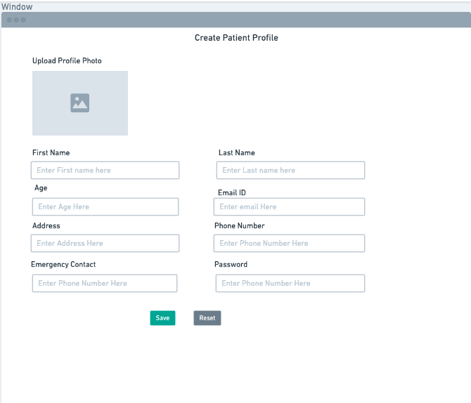
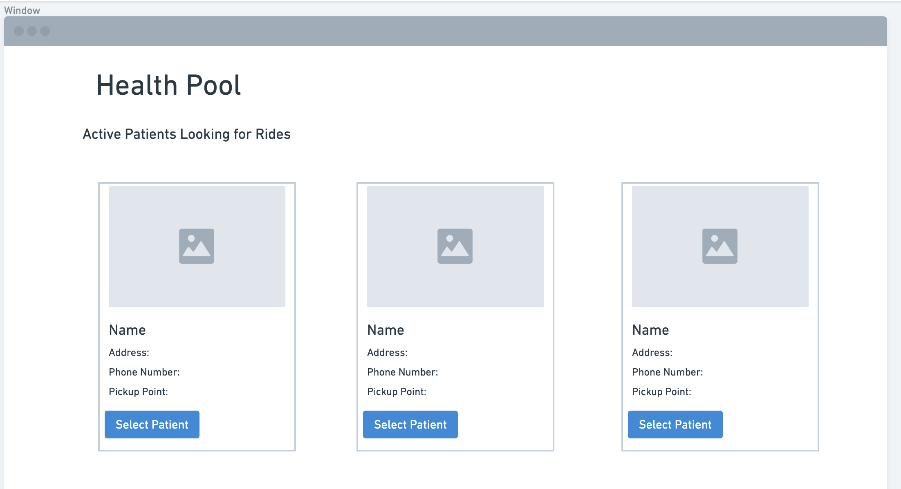

## Part 0 - Data Interactions

## Part 1 - Wireframes

#### 1. Patient Profile Page 

This page would be demonstarted as "patientProfile.html" and would serve as the page for users to create their patient profile adding data such as name, phone number, emergency number, address, age, etc. When patients want to opt into this program, they would go to this page to register and furthermore they can even edit details on this page for futher use.

#### 2. Patient Display Page

This page would be demonstarted as "patientSelectionPage.html" and would serve as the page for drivers to select patients who they volunteer to pick up. When drivers select patients, it will register the driver as a volunteer driver.

