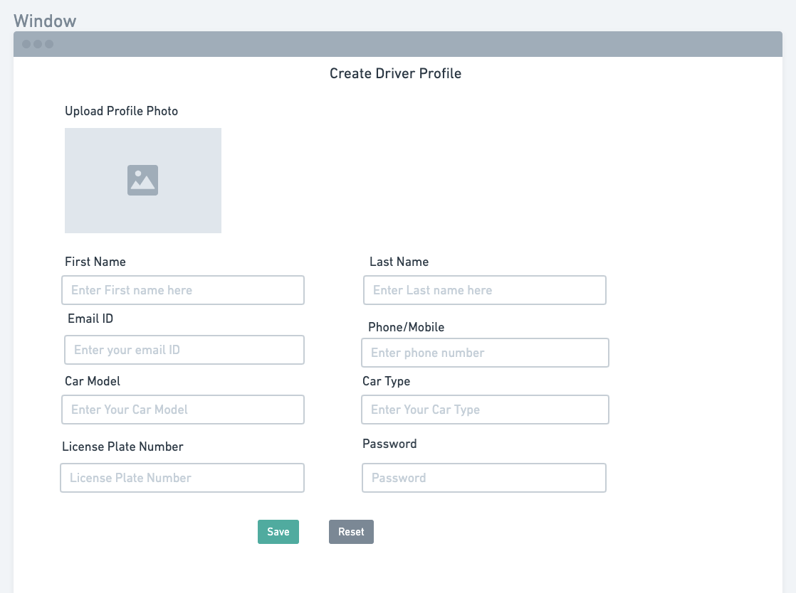
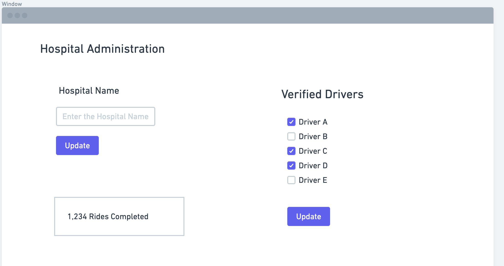

## Part 0 - Data Interactions

## Part 1 - Wireframes

#### 1. Patient Profile Page 

This page would be demonstarted as "patientProfile.html" and would serve as the page for users to create their patient profile adding data such as name, phone number, emergency number, address, age, etc. When patients want to opt into this program, they would go to this page to register and furthermore they can even edit details on this page for futher use.

#### 2. Patient Display Page

This page would be demonstarted as "patientSelectionPage.html" and would serve as the page for drivers to select patients who they volunteer to pick up. When drivers select patients, it will register the driver as a volunteer driver.

#### 3. Driver Profile Page 

This page would be demonstarted as "driverProfile.html" and would serve as the page for users to create their volunteer driver profile adding data such as name, phone number, car model, car license plate number, car type, etc. When drivers want to volunteer for this program, they would go to this page to register and furthermore they can even edit details on this page for futher use.

#### 3. Hospital Admin Page 

This page would be demonstarted as ".html" and would serve as the page for hosptials to manage their driver-patient volunteer program adding data such as hospital name, verified drivers, number of rides completed at the hospital, etc. Hospitals can even update their data from this page.

## Contributions

1. Abhinav Tripathy:

2. Aditya Narayanan: Aditya contributed towards creating the profile registration page and wireframe for patients, the page and wireframe for drivers to go and select patients, the javascript code to add an image in the registratiom page, and adding content to `milestone1.md`.

3. Joseph Black:

